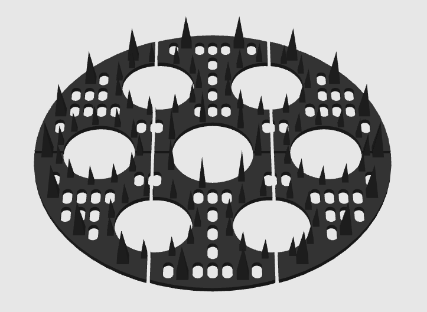
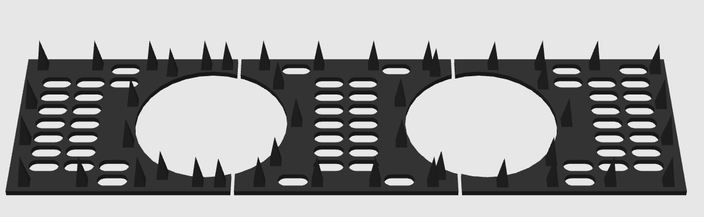

# 3D Print - Squirrel Guards

Parametric OpenSCAD covers for flower boxes that let water drain while blocking squirrels from digging up plants. Two panel shapes: circular and rectangular.

## Requirements

- [OpenSCAD](https://openscad.org/) 2021.01 or later
- Python 3.x + pytest (for tests only)

## Using the SCAD files

Open either file in OpenSCAD. All parameters are exposed in the Customizer panel (View > Customizer).

**Key parameters for both designs:**

- `panel_diameter` / `panel_width` + `panel_length` - match the inside dimensions of your pot or box
- `slot_width` - keep at or below 18 mm to block a squirrel paw
- `border` - solid ring/edge with no drainage slots
- `spike_priority` - when true, spikes take precedence over slots; when false, slots take precedence
- `spikes_enabled` - to print with spikes to deter squirrels from digging. Can uncheck if you don't want spikes (or can print and turn upside down to use spikes as a stake instead)

**Printing in pieces:**

Both files support splitting the panel into a grid of segments for printers with limited bed size. Set `segments_x` and `segments_y` to divide the panel, then set `segment_to_print` to render one piece at a time. Each piece is re-centred at the origin for printing.

## Circular design

- One center plant hole with a ring of spikes around it
- Satellite holes arranged in a ring at a configurable orbit radius (defaults to the midpoint between the center hole edge and the panel edge)
- Border spikes on the outer ring, count rounded up to a multiple of `satellite_count` for rotational symmetry



## Rectangular design

- Two independent rows of plant holes: front row and back row
- Each row has its own hole count, radius, Y-offset, and spike settings
- Border spikes on all four edges using a CCW perimeter traversal so corner placement is unbiased


## Running the tests

Python tests for testing changes without opening Open Scad

```sh
pip install pytest
python -m pytest -v 2>&1
```

Both test files are picked up automatically via `pytest.ini`. Tests cover slot grid dimensions, spike placement validity, hole keepout zones, self-collision checks, and rotational symmetry.
